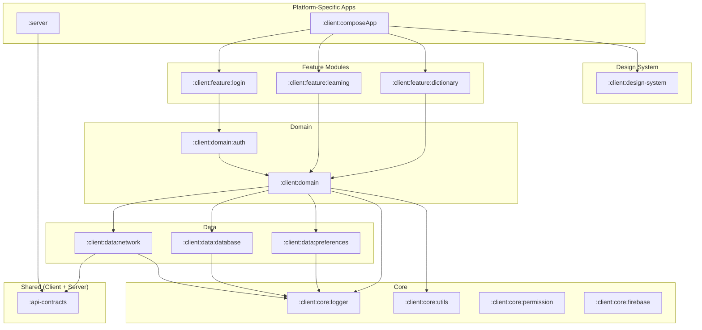

# Learn Chinese App - Kotlin Multiplatform Project

[](https://github.com/louisgautier/Sample-Compose-Multiplatform/actions/workflows/ci.yml)
[](https://github.com/louisgautier/Sample-Compose-Multiplatform/releases/latest)

This is a Kotlin Multiplatform project targeting Android, iOS, Desktop (JVM), and Server. It allows for sharing code across different platforms, reducing development time and ensuring consistency.

## Project Structure & Modules

The project is organized into several modules, each serving a distinct purpose. Here\'s an overview of the key modules:

## Module Dependency Graph

# Project Architecture

## Module Graph



---

## Modules

### Shared (Client + Server)

#### `:api-contracts`
Defines shared DTOs and API route definitions. Consumed by `:client:data:network` on the client side and `:server` on the backend, ensuring a type-safe contract between both ends.

- **Targets:** `commonMain`
- **Key Libraries:** Kotlinx Serialization

---

### Server

#### `:server`
Ktor-based backend server. Consumes `:api-contracts` to expose type-safe endpoints matching what the client expects.

- **Targets:** JVM
- **Key Libraries:** Ktor Server

---

### Feature Modules

Feature modules contain UI and presentation logic for a specific user-facing area. They depend on domain modules for business logic and on the design system for UI components.

#### `:client:feature:login`
Handles authentication flows — sign-in, sign-up, and session restore. Depends on `:client:domain:auth` for authentication-specific use cases.

- **Targets:** `commonMain`

#### `:client:feature:learning`
Learning experience feature. Depends on `:client:domain` for shared use cases and domain models.

- **Targets:** `commonMain`

#### `:client:feature:dictionary`
Dictionary and vocabulary feature. Depends on `:client:domain` for shared use cases and domain models.

- **Targets:** `commonMain`

---

### Domain

Domain modules contain business logic, use cases, and domain models (`DomainModel` — no suffix). They are free of any framework or platform dependency.

#### `:client:domain`
Houses shared business logic, use cases, and domain models used across multiple features. Sub-domains (e.g. `:domain:auth`) extend this layer for feature-specific business rules.

- **Targets:** `commonMain`, `androidMain`, `iosMain`, `jvmMain`
- **Key Libraries:** Kotlinx Coroutines

#### `:client:domain:auth`
Authentication-specific use cases and domain models — login, session, and token management. Depends on `:client:domain` for shared domain primitives.

- **Targets:** `commonMain`, `androidMain`, `iosMain`
- **Key Libraries:** Kotlinx Coroutines

---

### Data

Data modules handle all I/O concerns — network, local database, and preferences. They expose repositories consumed by the domain layer and work with `Dto` objects from `:api-contracts` at the network boundary.

#### `:client:data:network`
Implements the network client for API communication. Consumes `:api-contracts` DTOs for type-safe requests and responses, and maps them to domain models before exposing them upward.

- **Targets:** `commonMain`, `androidMain`, `iosMain`, `jvmMain` (platform-specific Ktor engines)
- **Key Libraries:** Ktor Client

#### `:client:data:database`
Manages local data persistence using a multiplatform database solution.

- **Targets:** `commonMain`, `androidMain`, `iosMain`, `jvmMain` (platform-specific drivers)
- **Key Libraries:** Room / SQLDelight

#### `:client:data:preferences`
Handles lightweight key-value storage for user preferences and app settings.

- **Targets:** `commonMain`, `androidMain`, `iosMain`, `jvmMain`
- **Key Libraries:** DataStore

---

### Core

Core modules provide low-level, domain-agnostic utilities. They have no knowledge of features, domain, or data layers and can be depended on by any module.

#### `:client:core:logger`
Provides a shared logging abstraction across all client modules.

- **Targets:** `commonMain`, `androidMain`, `iosMain`, `jvmMain`
- **Key Libraries:** Kermit

#### `:client:core:utils`
General-purpose utility functions and extensions shared across client modules.

- **Targets:** `commonMain`

#### `:client:core:permission`
Abstracts platform-specific permission handling (camera, location, etc.).

- **Targets:** `commonMain`, `androidMain`, `iosMain`

#### `:client:core:firebase`
Firebase integration — analytics, crash reporting, and other Firebase services — shared across client modules.

- **Targets:** `commonMain`, `androidMain`, `iosMain`
- **Key Libraries:** GitLive Firebase KMP SDK

---

### UI Modules

#### `:client:design-system`
Contains reusable, domain-agnostic UI components, theming, and typography shared across all features. Has no dependency on domain or data layers.

- **Targets:** `commonMain`, `androidMain`, `iosMain`, `jvmMain`
- **Key Libraries:** Compose Multiplatform

#### `:client:composeApp`
The top-level shared UI entry point. Wires together feature modules, applies the design system, and hosts navigation and app-level scaffolding.

- **Targets:** `commonMain`, `androidMain`, `iosMain`, `jvmMain`
- **Key Libraries:** Compose Multiplatform

---

## Naming Conventions

| Layer | Suffix | Example |
|---|---|---|
| `:api-contracts` DTOs | `Dto` | `UserDto`, `LoginResponseDto` |
| `:client:domain` models | none | `User`, `LoginResult` |

DTOs represent the raw wire format exchanged with the server. Domain models are the canonical representation used throughout the app. Mapping between the two happens at the data layer boundary (e.g. `UserDto.toDomain(): User`).
## Gradle Build Logic with Convention Plugins

This project leverages Gradle\'s `build-logic` module to centralize and manage build configurations
through **convention plugins**. This approach promotes:

* **Consistency:** Ensures uniform application of settings, dependencies, and plugins across similar
  modules.
* **Maintainability:** Simplifies updates to build configurations as changes are made in one place.
* **Readability:** Reduces boilerplate in individual module `build.gradle.kts` files, making them
  cleaner and focused on module-specific declarations.

Convention plugins are defined as Kotlin classes plugins (e.g., `ApplicationPlugin`,
`LibraryPlugin`) within the `/build-logic/src/main/kotlin` directory.

Modules can then apply these conventions using a simple plugin ID, for example:

```kotlin
// In a module's build.gradle.kts
plugins {
    id("kotlin-multiplatform-convention")
    // ... other plugins
}
```

This setup helps in managing a complex multi-module project more efficiently.

## Understanding Source Sets (Targets)

In Kotlin Multiplatform modules, you\'ll typically find the following source sets:
*   `commonMain`: Code that is common to all targeted platforms.
*   `androidMain`: Kotlin code specific to the Android platform.
*   `iosMain`: Kotlin code specific to the iOS platform (compiled to Native).
*   `jvmMain`: Kotlin code specific to JVM environments (e.g., Desktop applications).
*   `(platform)Test`: Unit tests for a specific platform, e.g. `commonTest`, `jvmTest`.

## Build and Run

For detailed build and run instructions for each platform, please refer to the following sections.

### Build and Run Android Application

To build and run the development version of the Android app, use the run configuration from the run widget in your IDE’s toolbar or build it directly from the terminal:
- on macOS/Linux
  ```shell
  ./gradlew :app:composeApp:assembleDebug
  ```
- on Windows
  ```shell
  .\gradlew.bat :app:composeApp:assembleDebug
  ```

### Build and Run Desktop (JVM) Application

To build and run the development version of the desktop app, use the run configuration from the run widget in your IDE’s toolbar or run it directly from the terminal:
- on macOS/Linux
  ```shell
  ./gradlew :app:composeApp:run
  ```
- on Windows
  ```shell
  .\gradlew.bat :app:composeApp:run
  ```

### Build and Run Server

To build and run the development version of the server, use the run configuration from the run widget in your IDE’s toolbar or run it directly from the terminal:
- on macOS/Linux
  ```shell
  ./gradlew :server:run
  ```
- on Windows
  ```shell
  .\gradlew.bat :server:run
  ```

### Build and Run iOS Application

To build and run the development version of the iOS app, use the run configuration from the run widget in your IDE’s toolbar or open the `[./iosApp](./iosApp)` directory in Xcode and run it from there.

---
**Note on Libraries:** The key libraries mentioned are indicative. For a complete list of dependencies for each module, please refer to the `build.gradle.kts` (or `build.gradle`) file within that module\'s directory.
---

Learn more about [Kotlin Multiplatform](https.www.jetbrains.com/help/kotlin-multiplatform-dev/get-started.html)…

## Future Enhancements (TODO)

This section outlines planned improvements and potential areas for future development:

*   **Secure Data Storage on Android (SQLCipher/Room):**
    *   Investigate and implement encrypted local database storage on Android. This involves replacing the current placeholder database in the `/app/database` module with a robust solution like Room, potentially with SQLCipher for an added layer of security to protect sensitive user data.

*   **Firebase Authentication (Server-Side):**
    *   Implement user authentication on the `/server` using the Firebase Admin SDK. The server will handle token verification and user management, providing a secure authentication flow for all client applications.

*   **Koin Dependency Injection Module Verification:**
    *   Enhance testing by adding integrity checks for Koin modules. This involves writing tests (likely in `commonTest` or platform-specific test source sets) that utilize Koin\'s testing utilities to verify that all dependency graphs can be correctly resolved at runtime.

*   **Continuous Integration/Continuous Deployment (CI/CD) with GitHub Actions:**
    *   Set up GitHub Actions workflows to automate the building, testing, and potentially deployment of the Android app, iOS app (if feasible via command-line tools), desktop app, and server application. This will ensure code quality and streamline the release process.

* **Auto generation of Mermaid graph:**
  *Make it reflect the current module dependency graph with a gradle task.

* **Setup Linter:**